# BotRunner — All Diagrams

> **Source:** Extracted from all documentation files in `docs/`
> **Format:** Mermaid

---

## From ARCHITECTURE.md

### System Architecture Diagram

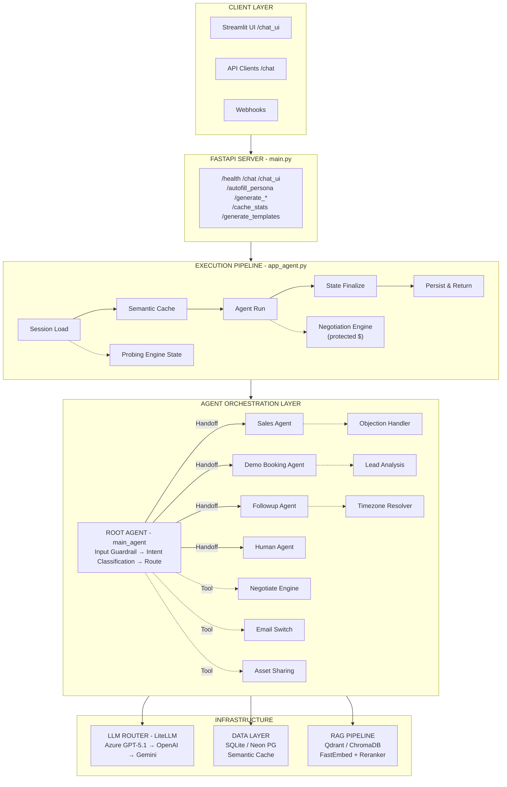

### Execution Pipeline (10-Step)

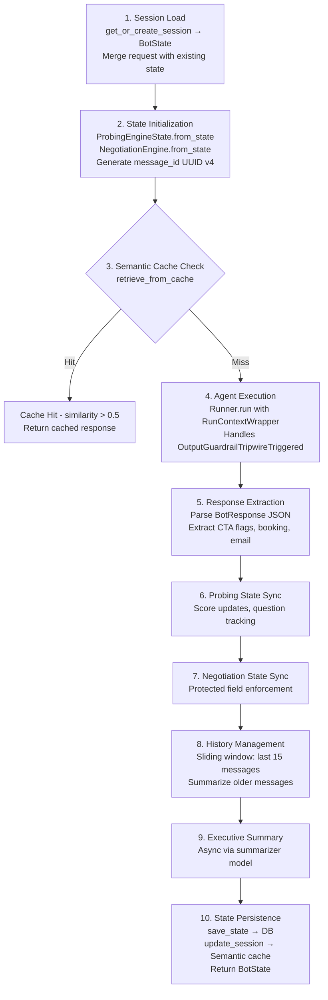

### Guardrail System

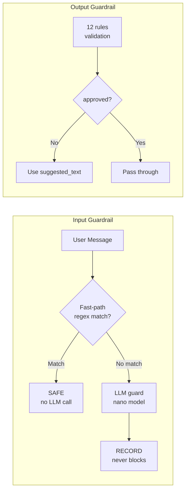

### Request Lifecycle

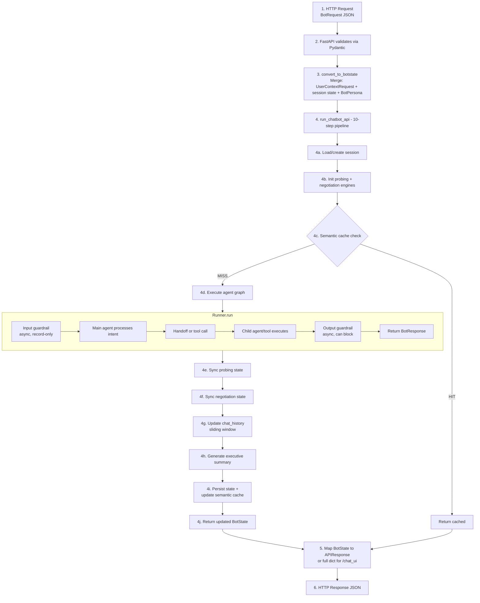

### State Management (BotState)

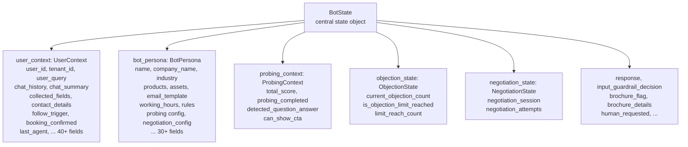

### Deployment — Development

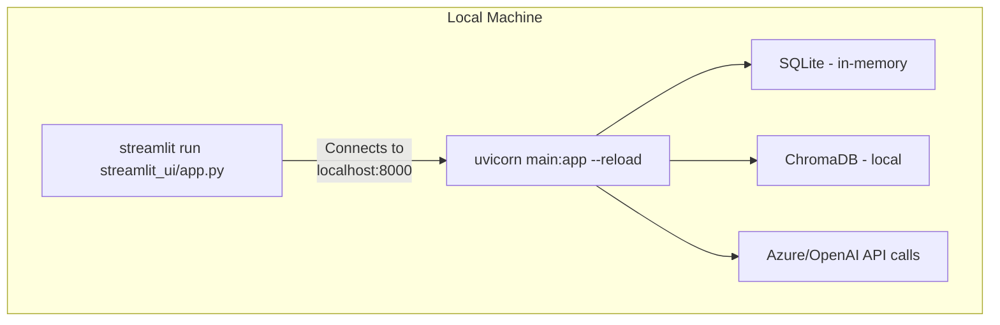

### Deployment — Production

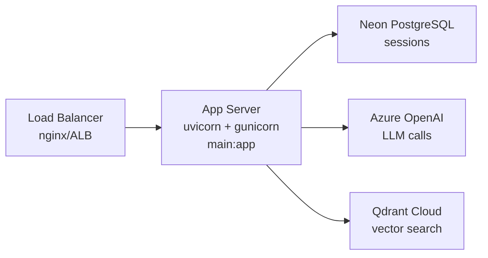

### Module Dependency Map

```mermaid
flowchart TD
    MAIN["main.py"] --> AA["app_agent.py"]

    AA --> FAC["app/agents/factory.py"]
    FAC --> DEF["app/agents/definitions.py"]
    DEF --> SALES["app/agents/sales/"]
    DEF --> BOOKING["app/agents/booking/"]
    DEF --> FOLLOWUP["app/agents/followup/"]
    DEF --> HUMAN["app/agents/human_escalation/"]
    DEF --> NEGO["app/agents/negotiation/"]
    DEF --> OBJ["app/agents/objection_handle/"]
    DEF --> EMAIL_A["app/agents/proceed_email/"]
    DEF --> LEAD["app/agents/lead_analysis/"]
    DEF --> BROCH["app/agents/brochure/"]
    DEF --> TMPL["app/agents/template_generation/"]
    FAC --> ACFG["app/agents/config.py"]
    ACFG --> ROUTE["app/route/route.py\nRouterModel, LiteLLM Router"]

    AA --> CORE["app/core/"]
    CORE --> MODELS["models.py - 60+ Pydantic models"]
    CORE --> GUARD["guardrail.py - input/output"]
    CORE --> PROBE["probing_state.py"]
    CORE --> NEGENG["negotiation.py"]
    CORE --> EXC["exceptions.py"]

    AA --> DB["app/database/"]
    DB --> SESSMGR["session_manager.py - SQLite"]
    DB --> PGMGR["postgresql_session_manager.py - Neon PG"]
    DB --> CACHE["cachememory.py - semantic cache"]
    DB --> SUMM["summarizer.py"]
    DB --> SLIDE["sliding_window.py"]
    DB --> EXECSUMM["executive_summary.py"]

    AA --> PROMPTS["app/prompts/\nall dynamic prompt generators"]
    AA --> UTILS["app/utils/\nprompt_cache.py, utils.py"]

    MAIN --> CFG["app/config/"]
    CFG --> SETTINGS["settings.py - env vars"]
    CFG --> CONST["constants.py - AgentName, defaults"]

    MAIN --> RAGMOD["rag/\nETL_Pipeline, Qdrant, retriever"]
    MAIN --> STUI["streamlit_ui/\napp.py, chat.py, persona.py, qa_panel.py"]
```

---

## From ARCHITECTURE_EVOLUTION.md

### Before vs After Architecture Comparison

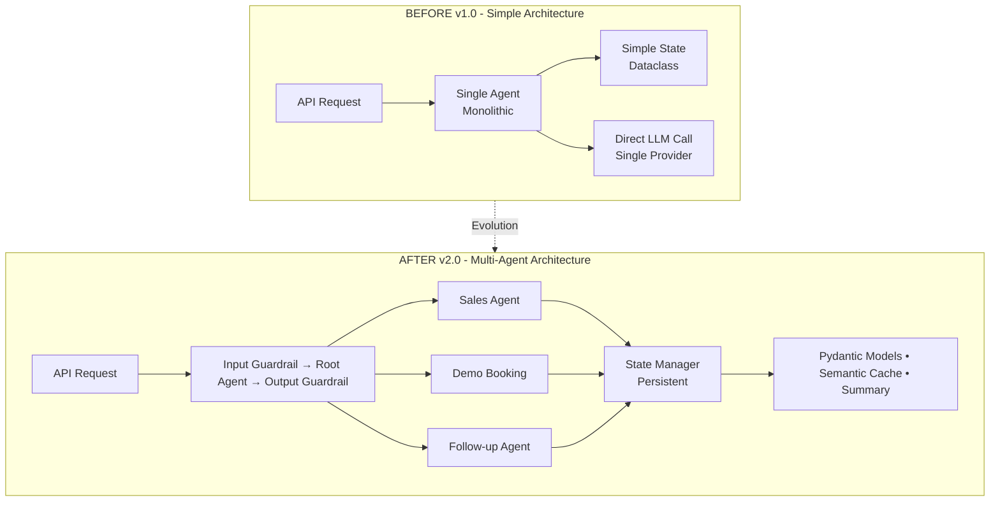

### Exception Hierarchy (v2.0)

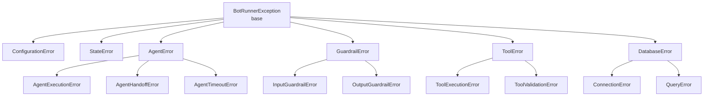

### Response Time Comparison

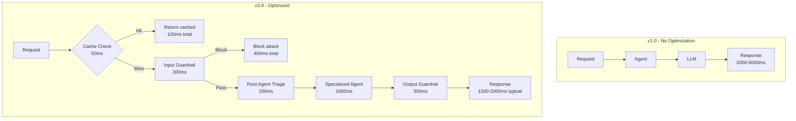

---

## From AGENT_FLOWS.md

### System Overview (Main Agent Flow)

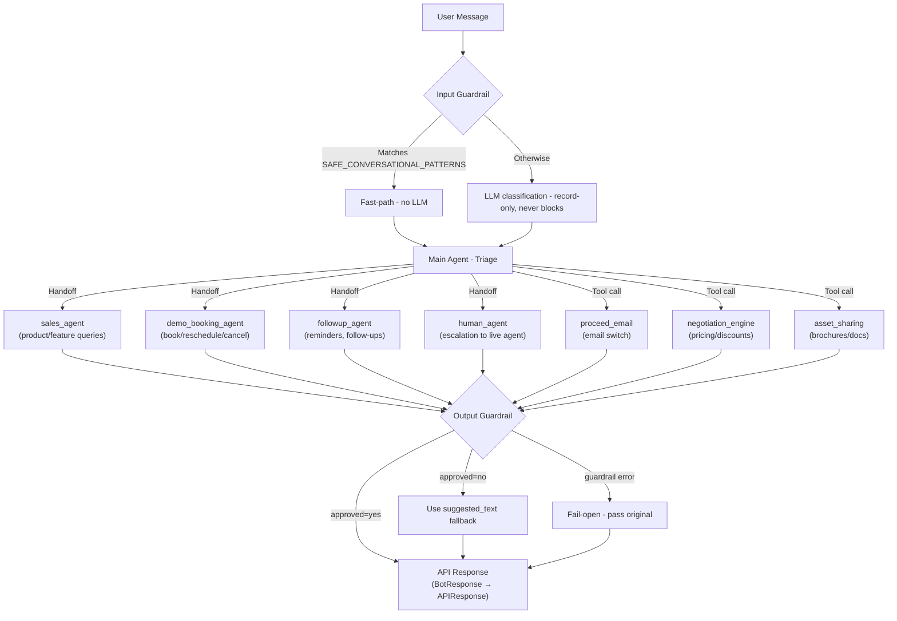

### Probing State Machine

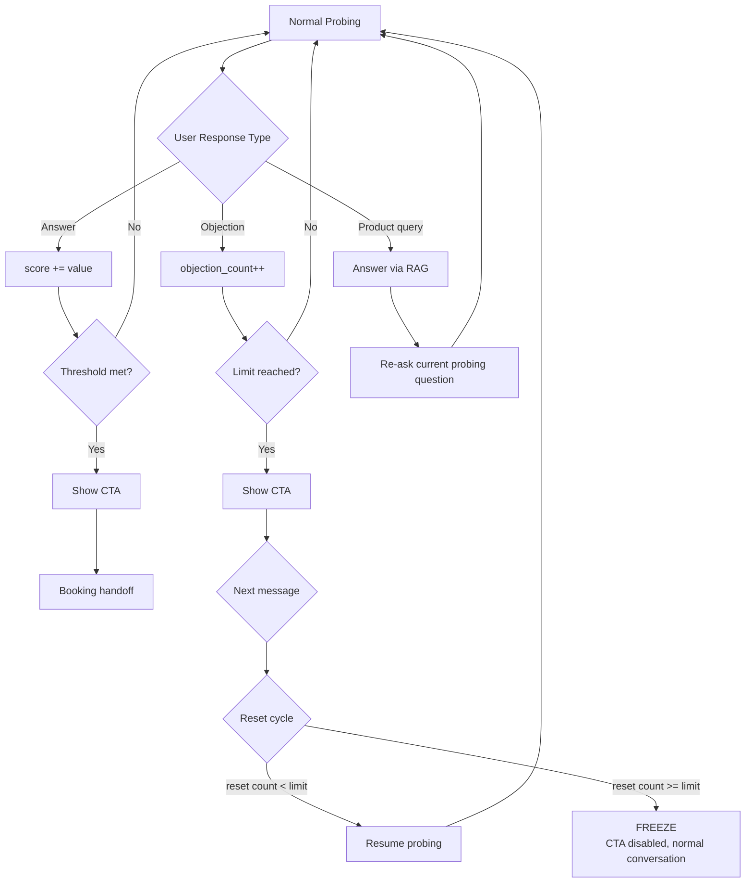

### Email Decision Tree

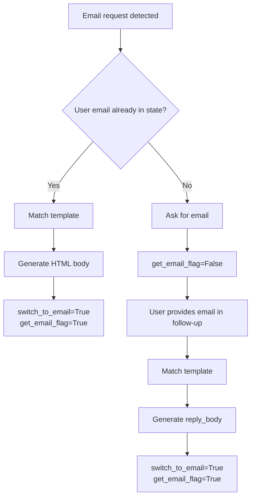

### Cross-Agent Workflow A: Probing → CTA → Booking

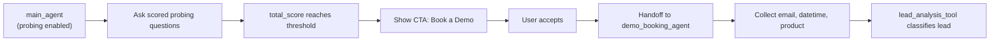

### Cross-Agent Workflow B: Sales → Negotiation → Booking

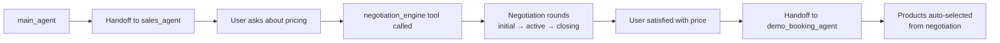

### Cross-Agent Workflow C: Booking → Unavailable → Follow-up

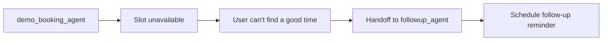

### Cross-Agent Workflow D: Any Point → Human Escalation

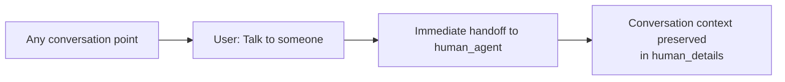

### Cross-Agent Workflow E: Sales → Objection → Asset Share → Booking

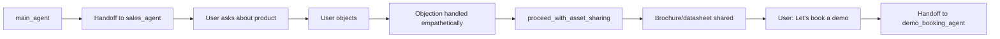

---

## From PERSONA_GUIDE.md

### Persona to Agent Instruction Flow

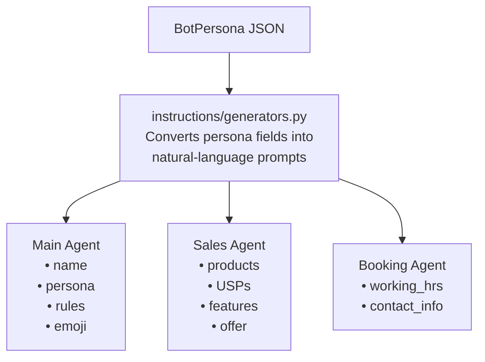

---

## From PRODUCTION_FEATURES.md

### LLM Fallback Chain

```mermaid
flowchart TD
    P["Primary\nOpenAI gpt-4.1"] -->|"failure"| F1["Fallback 1\nAzure gpt-4.1"]
    F1 -->|"failure"| F2["Fallback 2\nGemini gemini-3-flash"]
```

### Exception Hierarchy (Production)

```mermaid
flowchart TD
    BRE["BotRunnerException\nbase"] --> CE["ConfigurationError"]
    BRE --> SE["StateError"]
    SE --> SVE["StateValidationError"]
    BRE --> AE["AgentError"]
    AE --> AEE["AgentExecutionError"]
    AE --> AHE["AgentHandoffError"]
    AE --> ATE["AgentTimeoutError"]
    BRE --> GE["GuardrailError"]
    GE --> IGE["InputGuardrailError"]
    GE --> OGE["OutputGuardrailError"]
    BRE --> TE["ToolError"]
    TE --> TEE["ToolExecutionError"]
    TE --> TVE["ToolValidationError"]
    BRE --> DBE["DatabaseError"]
    DBE --> DCE["ConnectionError"]
    DBE --> QE["QueryError"]
    BRE --> ESE["ExternalServiceError"]
    ESE --> CAL["CalendlyAPIError"]
```
